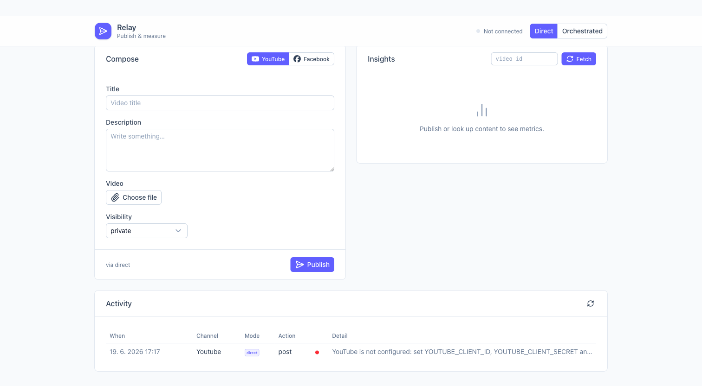

# Marketing Microsite

A small, deployed microsite that **publishes a post to a controlled business account** and then **fetches and displays metrics** for that content — implemented in **two execution modes** (Direct API + Orchestrated via n8n), deployed with **infrastructure as code**, with **secrets kept out of source**.

> Candidate assignment implementation. Two platforms are fully wired in **both** execution modes: **YouTube** (the no-review, self-service path for a single owned account) and **Facebook Pages** (page feed posts + engagement). The assignment only required one — the adapter layer makes the second nearly free.



---

## What it does

- **Post** a test video to a YouTube channel you own (or a text/photo post to a Facebook Page you own).
- **Fetch metrics** for that content and show them in a **normalized** format (views / likes / comments / …).
- Toggle between **Direct** and **Orchestrated** execution — the UI shows **which mode produced each result**.
- Surfaces **content ID, timestamps, the execution mode, a raw-response viewer, a refresh action, and an audit log**.

## Two execution modes

| | Direct | Orchestrated |
|---|---|---|
| Who calls the platform API | the Nitro server route (app code) | an **n8n** workflow |
| How it's triggered | `POST /api/post` → adapter | `POST /api/post` → n8n webhook (Header Auth) → platform |
| Metrics mapping | shared `normalize()` | shared `normalize()` (same internal format) |

Both modes feed the **same** `normalize()` mapper, so the internal metrics shape is identical regardless of path (assignment nice-to-have: *normalized internal metrics format across both modes*).

## Architecture

```
Browser (Nuxt UI)
  platform [YouTube | Facebook]   mode [Direct | Orchestrated]
  actions: Post · Fetch metrics · Refresh
        │
        ▼
Nitro server routes  (Cloudflare Worker)         ← secrets via env bindings
  ├─ /api/post     Direct → adapter.publishDirect()   |  Orchestrated → n8n webhook
  ├─ /api/metrics  Direct → adapter.fetchMetricsDirect | Orchestrated → n8n webhook
  │                 → adapter.normalize(raw)  (one shape for both modes)
  ├─ /api/config   which platforms/modes are configured
  ├─ /api/audit    recent audit rows
  ├─ KV  TOKEN_CACHE   short-lived OAuth access-token cache
  └─ D1  AUDIT_DB      append-only audit log
        │
        └─ n8n (public: n8n Cloud / VPS)  ← workflow committed at orchestration/n8n-workflow.json
              Webhook(HeaderAuth) → Prep(init/metrics) → IF(action) → HTTP Request(binary PUT) → Respond
              routes by platform (YouTube binary upload vs Facebook feed post)
              token broker: the Worker passes a short-lived YouTube token or the Facebook Page token; n8n stores no platform creds
```

## Tech stack

- **Nuxt 3 / Nitro** on **Cloudflare Workers** (`cloudflare_module` preset), **Nuxt UI** for the UI.
- **Cloudflare KV** (token cache) + **D1** (audit log).
- **Terraform** (`cloudflare/cloudflare` v5) provisions KV + D1; **Wrangler** deploys the Worker.
- **n8n** for the orchestrated path (workflow JSON + docker-compose committed).

## Repository layout

```
app/                       Nuxt UI single-page microsite (app/pages/index.vue)
server/
  api/post.post.ts         publish (direct | orchestrated)
  api/metrics.post.ts      fetch metrics (direct | orchestrated)
  api/config.get.ts        config status for the UI
  api/audit.get.ts         audit log read
  adapters/youtube.ts      DIRECT YouTube: resumable upload + videos.list + normalize
  adapters/facebook.ts     DIRECT Facebook Pages (feed post + engagement)
  adapters/types.ts        PlatformAdapter interface
  orchestration/n8n.ts     ORCHESTRATED client (webhook + Header Auth)
  utils/env.ts             reads secrets/bindings from event.context.cloudflare.env
  utils/youtube-oauth.ts   refresh_token → access_token (cached in KV)
  utils/audit.ts           D1 read/write
shared/types.ts            types shared by UI + server (incl. NormalizedMetrics)
orchestration/
  n8n-workflow.json        importable orchestrated workflow
  docker-compose.yml       reproducible self-hosted n8n
infra/                     Terraform: KV + D1 + outputs (+ schema.sql for the audit log)
wrangler.toml              Worker deploy config + KV/D1 bindings
.dev.vars.example          local secrets template (copy to .dev.vars)
```

---

## Prerequisites

- Node 20+ and npm.
- A **Cloudflare account** (free tier is enough) + an API token (Workers, KV, D1 edit).
- **Terraform** ≥ 1.6 (or OpenTofu).
- For the orchestrated path: **n8n** (n8n Cloud, or Docker via `orchestration/docker-compose.yml`).
- A **dummy YouTube channel** + a Google Cloud OAuth client (see external setup).
- *(optional)* a dummy **Facebook Page** + Meta app for the second platform.

> The external account / OAuth / hosting setup is the part that can't be scripted from this repo. A condensed checklist is below; **[`docs/SETUP.md`](docs/SETUP.md)** has the full step-by-step walkthrough (incl. a helper that fetches a YouTube refresh token for you: `npm run oauth:youtube`).

## External setup (condensed)

1. **YouTube OAuth** — In Google Cloud: enable *YouTube Data API v3*, configure the OAuth consent screen and set it to **Production** (Testing-mode refresh tokens expire after 7 days), create an OAuth **client**, and obtain a **refresh token** with scopes `youtube.upload` + `youtube.readonly`. Put `YOUTUBE_CLIENT_ID`, `YOUTUBE_CLIENT_SECRET`, `YOUTUBE_REFRESH_TOKEN` into `.dev.vars` (local) and Worker secrets (prod).
2. **n8n** — Start n8n (`cd orchestration && docker compose up -d`, or n8n Cloud). Import `orchestration/n8n-workflow.json`. Attach a **YouTube OAuth2** credential to the two YouTube nodes and an **HTTP Header Auth** credential (header `X-N8N-Auth`) to the Webhook node, then **activate**. Set `N8N_WEBHOOK_URL` (the **production** webhook URL) and `N8N_WEBHOOK_TOKEN` (the header value). A deployed Worker needs n8n to be **publicly reachable** (Cloud / VPS / tunnel) — `localhost` won't work from the edge.
3. **Cloudflare** — `export TF_VAR_cloudflare_api_token=…` and set `cloudflare_account_id` in `infra/terraform.tfvars`.
4. *(optional)* **Facebook** — Create a Page + Meta business-type app, get a long-lived Page access token; set `FACEBOOK_PAGE_ID`, `FACEBOOK_PAGE_ACCESS_TOKEN`.

---

## Local development

```bash
npm install
cp .dev.vars.example .dev.vars      # fill in secrets you have
npm run db:local                    # create the audit_log table in the local D1
npm run dev                         # http://localhost:3000
```

`nuxt dev` runs with `nitro-cloudflare-dev`, so KV/D1/secret bindings resolve from `wrangler.toml` + `.dev.vars` exactly as they do in production. Unconfigured platforms/modes return a clear, actionable error (the UI shows what's missing) instead of crashing.

## Deploy (infrastructure as code)

```bash
# 1. Provision durable resources (KV + D1)
export TF_VAR_cloudflare_api_token=…
terraform -chdir=infra init
terraform -chdir=infra apply

# 2. Copy the outputs into wrangler.toml
terraform -chdir=infra output        # kv_namespace_id, d1_database_id, d1_database_name
#   → set [[kv_namespaces]].id and [[d1_databases]].database_id in wrangler.toml

# 3. Create the audit table on the remote D1
npm run db:remote

# 4. Set secrets (kept out of source AND out of Terraform state)
npx wrangler secret put YOUTUBE_CLIENT_ID
npx wrangler secret put YOUTUBE_CLIENT_SECRET
npx wrangler secret put YOUTUBE_REFRESH_TOKEN
npx wrangler secret put N8N_WEBHOOK_URL
npx wrangler secret put N8N_WEBHOOK_TOKEN
#   (+ FACEBOOK_* if using the second platform)

# 5. Build + deploy the Worker
npm run deploy        # = nuxt build && wrangler deploy
```

**Why this split?** Nitro's `cloudflare_module` output is a multi-chunk bundle that Wrangler understands natively, so Wrangler deploys the Worker while Terraform owns the durable resources (KV/D1). This is more robust than forcing the script through Terraform.

## Secrets handling

- Nothing secret is committed: `.dev.vars`, `.env`, Terraform state and `*.tfvars` are git-ignored; only `*.example` templates are tracked.
- **Local:** `.dev.vars` (git-ignored).
- **Production:** Cloudflare **Worker secrets** (`wrangler secret put`) — they are encrypted at rest and **never enter Terraform state**.
- The Cloudflare API token reaches Terraform via `TF_VAR_cloudflare_api_token` (environment), not a file.
- The server reads everything from `event.context.cloudflare.env` (see `server/utils/env.ts`), never from hard-coded values.

---

## Assignment coverage

**Minimum acceptance criteria**

- [x] Publish a test post to a controlled dummy account — `adapters/youtube.ts` (resumable upload) / `adapters/facebook.ts`.
- [x] Fetch metrics and display them clearly — `/api/metrics` + normalized metric cards.
- [x] Both Direct and Orchestrated modes — `adapters/*` vs `orchestration/n8n.ts` + `orchestration/n8n-workflow.json`.
- [x] Deployed and reproducible via IaC — `infra/` (Terraform) + `wrangler.toml`.
- [x] Secrets handled outside source code — Worker secrets / `TF_VAR_*` / `.dev.vars` (git-ignored).

**Deliverables**

- [x] Application source code (`app/`, `server/`, `shared/`).
- [x] Orchestrated integration path (`orchestration/`, `server/orchestration/n8n.ts`).
- [x] Direct API path (`server/adapters/`).
- [x] Infrastructure-as-code files (`infra/`, `wrangler.toml`).
- [x] README with setup / run / deploy (this file).

**Optional nice-to-haves**

- [x] Normalized internal metrics format across both modes (`NormalizedMetrics` + shared `normalize()`).
- [x] Raw-response viewer (collapsible JSON under the metrics).
- [x] Audit log of requests and results (D1 + audit table in the UI).
- [x] Refresh action for metrics.

## Notes & limitations

- **YouTube uploads from an unverified app are forced to `private`.** Metrics (`statistics`) still return real numbers (you can like/comment your own video); flip visibility in YouTube Studio if you want public view accrual.
- **Workers free plan caps CPU at 10 ms/request.** The only CPU-bound step is base64-decoding the upload — keep test videos small (≈≤2 MB) or use Workers Paid.
- **YouTube quota:** `videos.insert` costs 1600 units (daily default 10,000) and has short-window rate limits — rapid repeated upload tests can transiently fail with 400; space them out.
- **Orchestrated binary upload** uses an n8n **HTTP Request node** (its Code node UTF-8-corrupts a raw Buffer body). n8n holds no Google credentials — the Worker brokers a short-lived access token to it.
- Both YouTube and Facebook work in both Direct and Orchestrated modes; the n8n workflow routes by platform (only the YouTube post needs the binary-upload branch).
